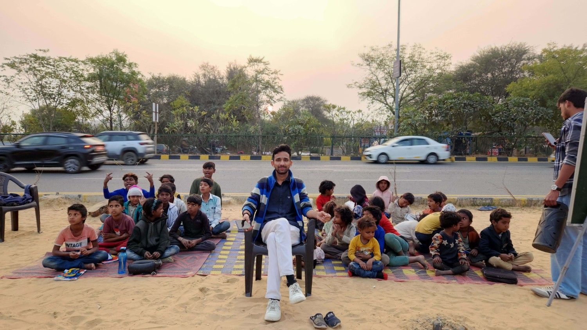

# Jaiti Foundation - Professional Website

## 📋 Overview

This is a complete, professional website for **Jaiti Foundation** - an NGO dedicated to providing free education, moral values, civic sense, and nutritious food to underprivileged children in Jaipur, Rajasthan.

---

## ✨ Features

### 🎨 **Modern Professional Design**
- Clean, contemporary design with smooth animations
- Fully responsive (works perfectly on mobile, tablet, and desktop)
- Professional color scheme with blue primary colors
- Beautiful typography using Playfair Display and Inter fonts

### 📄 **Complete Pages Included**
1. **index.html** - Homepage with hero section, impact statistics, and program overview
2. **about.html** - About Us page with mission, vision, values, and story
3. **programs.html** - Detailed information about all 4 programs offered
4. **gallery.html** - Photo gallery with interactive hover effects
5. **volunteer.html** - Get Involved page with volunteer opportunities
6. **contact.html** - Contact page with form and information

### 🎯 **Key Sections**
- ✅ Impactful hero section with statistics
- ✅ Mission, Vision & Values clearly stated
- ✅ Detailed program descriptions (Education, Moral Values, Civic Sense, Nutrition)
- ✅ Professional gallery with lightbox effect
- ✅ Volunteer opportunities (NO donation buttons - as requested)
- ✅ Contact form with validation
- ✅ Responsive mobile menu
- ✅ Smooth scrolling and animations

### 🚫 **What's Removed**
- ❌ All donation buttons and payment functionality
- ❌ Any mention of financial contributions
- ✅ Replaced with volunteer and collaboration opportunities

---

## 📁 Files Included

```
├── index.html          # Homepage
├── about.html          # About Us page
├── programs.html       # Our Programs page
├── gallery.html        # Gallery page
├── volunteer.html      # Get Involved page
├── contact.html        # Contact page
├── styles.css          # Complete stylesheet
├── script.js           # JavaScript functionality
└── README.md           # This file
```

---

## 🚀 Installation & Setup

### **Step 1: Create Images Folder**
Create a folder named `images` in the same directory as your HTML files.

### **Step 2: Add Your Images**
Place the following images in the `images` folder:
- `logo.jpg` - Your foundation's logo
- `photo1.jpg` through `photo10.jpg` - Photos of your activities, children, classes, etc.

**Image Recommendations:**
- Logo: 200x200px (square)
- Photos: 800x600px minimum (landscape orientation preferred)
- Use JPG format for photos (better file size)

### **Step 3: Upload to Web Server**
Upload all files (HTML, CSS, JS, and images folder) to your web hosting server.

### **Step 4: Test**
Open `index.html` in your browser to see your website!

---

## 🎨 Customization Guide

### **Colors** (in styles.css)
```css
:root {
    --primary: #1e40af;        /* Main blue color */
    --primary-light: #3b82f6;  /* Lighter blue */
    --primary-dark: #1e3a8a;   /* Darker blue */
}
```
**To change colors:** Replace the hex color codes with your preferred colors.

### **Content**
- Open any HTML file in a text editor
- Find the text you want to change
- Replace with your own content
- Save and refresh your browser

### **Adding More Photos**
In `gallery.html`, add more gallery items like this:
```html
<div class="gallery-item">
    
    <div class="gallery-overlay">
        <div class="gallery-caption">
            <h3>Caption Title</h3>
            <p>Caption description</p>
        </div>
    </div>
</div>
```

---

## 📱 Responsive Features

The website automatically adapts to:
- 📱 Mobile phones (320px and up)
- 💻 Tablets (768px and up)
- 🖥️ Desktops (1024px and up)
- 🖥️ Large screens (1440px and up)

---

## ⚡ JavaScript Features

1. **Mobile Menu Toggle** - Hamburger menu for mobile devices
2. **Smooth Scrolling** - Smooth navigation between sections
3. **Counter Animation** - Animated statistics (60+, 150+, etc.)
4. **Contact Form Validation** - Basic form validation
5. **Gallery Lightbox** - Click photos to view larger
6. **Scroll Animations** - Elements fade in as you scroll
7. **Back to Top Button** - Easy navigation to top of page
8. **Navbar Scroll Effect** - Navbar shadow on scroll

---

## 🔧 Browser Compatibility

✅ Chrome (latest)
✅ Firefox (latest)
✅ Safari (latest)
✅ Edge (latest)
✅ Mobile browsers (iOS Safari, Chrome Mobile)

---

## 📊 Statistics to Update

Update these numbers in your HTML files:

**In index.html:**
- 100+ students currently enrolled
- 200+ children impacted since 2024

**In about.html, programs.html, gallery.html:**
- Same statistics appear - update all occurrences

---

## 📧 Contact Form

The contact form is currently set up with **client-side validation only**. 

**To make it work:**
1. Set up an email service (e.g., FormSubmit, EmailJS, or your hosting's email service)
2. Update the form action in `contact.html`
3. Or integrate with a backend service

**Current behavior:** Form validates input and shows success message (no actual email sent yet)

---

## 🎯 SEO Optimization

Each page includes:
- ✅ Proper meta descriptions
- ✅ Semantic HTML structure
- ✅ Descriptive alt text for images
- ✅ Proper heading hierarchy
- ✅ Mobile-friendly design

**Recommendation:** Add Google Analytics code before closing `</body>` tag for tracking.

---

## 🌟 Future Enhancements (Optional)

1. **Blog Section** - Share stories and updates
2. **Newsletter Signup** - Collect email subscribers
3. **Social Media Integration** - Add social media links
4. **Multi-language Support** - Hindi/English toggle
5. **Video Integration** - Embed YouTube videos
6. **Events Calendar** - Upcoming events and activities

---

## 💡 Important Notes

### **Registration Status**
- The website includes a note in the footer: "Jaiti Foundation is currently in the process of official registration"
- Update or remove this once registration is complete

### **Email Address**
- Currently set to: `jaitifoundation@gmail.com`
- Update all occurrences if you change email

### **Location**
- Currently set to: Jaipur, Rajasthan, India
- Update if needed in footer and contact page

---

## 🆘 Troubleshooting

**Images not showing?**
- Check that images are in the `images/` folder
- Check file names match exactly (case-sensitive)
- Check file extensions (.jpg, not .JPG)

**Menu not working on mobile?**
- Check that script.js is linked correctly
- Clear browser cache and reload

**Layout looks broken?**
- Check that styles.css is linked correctly
- Check for any missing closing tags in HTML

**Contact form not submitting?**
- Form is currently client-side only
- Check browser console for JavaScript errors

---

## 📞 Support

If you need help with customization or have questions:

1. Check this README file first
2. Review the code comments in HTML/CSS/JS files
3. Search online for specific CSS/JavaScript issues
4. Consider hiring a web developer for advanced customizations

---

## 📄 License & Credits

**Design & Development:** Custom built for Jaiti Foundation
**Fonts:** Google Fonts (Playfair Display, Inter)
**Icons:** Custom SVG icons
**Images:** To be provided by Jaiti Foundation

---

## 🎉 Thank You!

Thank you for choosing this website for Jaiti Foundation. Your work in empowering underprivileged children through education is truly inspiring!

---

**Version:** 1.0  
**Last Updated:** February 2026  
**Build Status:** Production Ready ✅

---

## Quick Start Checklist

- [ ] Download all files
- [ ] Create `images` folder
- [ ] Add logo.jpg and photo1-10.jpg
- [ ] Update email address if needed
- [ ] Test all pages locally
- [ ] Upload to web hosting
- [ ] Test on mobile device
- [ ] Share with the world! 🌍

---

**Made with ❤️ for children's education and brighter futures**
